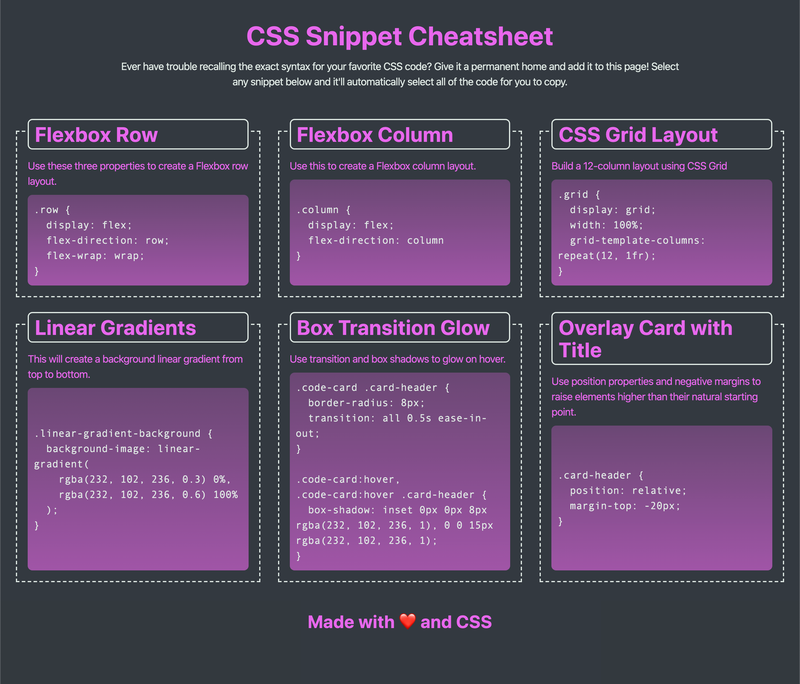

# CSS Cheatsheet

## Description
In this mini-project for module 2, we were given a PDF template of a CSS Cheatsheet for desktop, tablet, and mobile screens. From scratch, we were asked to create web page that looked like the provided templates for each respective viewport. My current version is only for desktop screens, but I will add media queries next. It features flexbox so technically it is still responsive to changing viewports, but I'd like to create media queries nonetheless for cleaner layout.

This project also includes different selection background and box transition glow on hover (as seen in screenshot below).

## Live Page
[Live Page](https://mbronstein1.github.io/CSS-Cheatsheet/)

## Screenshot of Templates
### Desktop Template

### Tablet Template

### Mobile Template
